# Практическое занятие №5 (21). Реализация HTTPS (TLS-сертификаты). Защита от SQL-инъекций


## Выполнил: Туев Д. ЭФМО-01-25

## Содержание

1. [Описание проекта](#описание-проекта)
2. [HTTPS/TLS реализация](#httpstls-реализация)
3. [Защита от SQL-инъекций](#защита-от-sql-инъекций)
4. [Структура проекта](#структура-проекта)
5. [Запуск сервисов](#запуск-сервисов)
6. [Скриншоты выполнения](#скриншоты-выполнения)
7. [Примеры работы](#примеры-работы)
8. [Выводы](#выводы)
9. [Контрольные вопросы](#контрольные-вопросы)

---

## Описание проекта

В рамках практического занятия №21 на базе сервиса **Tasks** из предыдущих работ реализованы два ключевых аспекта безопасности:

1. **HTTPS/TLS** — защита канала передачи данных с использованием самоподписанных сертификатов и reverse proxy (NGINX).
2. **Защита от SQL-инъекций** — демонстрация уязвимости при конкатенации строк и её исправление с помощью параметризованных запросов.

**Архитектура решения:**
- **Auth service** — gRPC сервер для проверки токенов (порт 50051)
- **Tasks service** — HTTP REST API для работы с задачами (порт 8082)
- **PostgreSQL** — база данных для хранения задач (в Docker)
- **NGINX** — reverse proxy с TLS-терминацией (порт 8443)

---

## HTTPS/TLS реализация

### Выбор подхода

Для реализации HTTPS был выбран вариант с **NGINX как TLS-терминатором** по следующим причинам:
- Ближе к промышленной практике (разделение ответственности)
- Упрощает управление сертификатами
- Позволяет приложению оставаться внутри сети без необходимости поддержки TLS

### Генерация самоподписанного сертификата

Для локального тестирования сгенерирован самоподписанный сертификат с помощью OpenSSL:

```bash
openssl req -x509 -newkey rsa:2048 -nodes \
  -keyout deploy/tls/key.pem \
  -out deploy/tls/cert.pem \
  -days 365 \
  -subj "/CN=localhost"
```

**Созданные файлы:**
- `cert.pem` — публичный сертификат
- `key.pem` — приватный ключ (не подлежит распространению)

### Конфигурация NGINX

Файл `deploy/tls/nginx.conf`:

```nginx
events {}

http {
    server {
        listen 8443 ssl;
        server_name localhost;

        ssl_certificate /etc/nginx/tls/cert.pem;
        ssl_certificate_key /etc/nginx/tls/key.pem;

        location / {
            proxy_pass http://tasks:8082;
            proxy_set_header Host $host;
            proxy_set_header X-Real-IP $remote_addr;
            proxy_set_header X-Forwarded-For $proxy_add_x_forwarded_for;
            proxy_set_header X-Forwarded-Proto https;
            proxy_set_header Authorization $http_authorization;
            proxy_set_header X-Request-ID $http_x_request_id;
        }
    }
}
```

### Docker Compose для TLS

```yaml
version: '3.8'

services:
  postgres:
    image: postgres:15-alpine
    container_name: tasks-db
    environment:
      POSTGRES_USER: tasks_user
      POSTGRES_PASSWORD: tasks_pass
      POSTGRES_DB: tasks_db
    ports:
      - "5432:5432"
    volumes:
      - postgres_data:/var/lib/postgresql/data
      - ../../migrations:/docker-entrypoint-initdb.d

  nginx:
    image: nginx:alpine
    container_name: tasks-nginx
    ports:
      - "8443:8443"
    volumes:
      - ./nginx.conf:/etc/nginx/nginx.conf:ro
      - ./cert.pem:/etc/nginx/tls/cert.pem:ro
      - ./key.pem:/etc/nginx/tls/key.pem:ro
    depends_on:
      - postgres
```

---

## Защита от SQL-инъекций

### Уязвимая реализация (для демонстрации)

В методе `SearchByTitleUnsafe` продемонстрирована классическая SQL-инъекция через конкатенацию строк:

```go
// УЯЗВИМАЯ ВЕРСИЯ - НЕ ИСПОЛЬЗОВАТЬ В ПРОДАКШЕНЕ!
func (r *PostgresTaskRepository) SearchByTitleUnsafe(ctx context.Context, titleSubstring string) ([]*models.Task, error) {
    query := fmt.Sprintf("SELECT id, title, description, done, created_at, updated_at FROM tasks WHERE title LIKE '%%%s%%'", titleSubstring)
    rows, err := r.db.QueryContext(ctx, query)
    // ...
}
```

### Безопасная реализация (параметризованные запросы)

Исправленная версия использует плейсхолдеры `$1`:

```go
// БЕЗОПАСНАЯ ВЕРСИЯ с параметризованным запросом
func (r *PostgresTaskRepository) SearchByTitle(ctx context.Context, titleSubstring string) ([]*models.Task, error) {
    query := `SELECT id, title, description, done, created_at, updated_at FROM tasks WHERE title ILIKE $1`
    rows, err := r.db.QueryContext(ctx, query, "%"+titleSubstring+"%")
    // ...
}
```

### Эндпоинт для демонстрации

Добавлен эндпоинт `GET /v1/tasks/search` с параметром `unsafe`:

```
GET /v1/tasks/search?q=<query>&unsafe=true
```

Параметр `unsafe=true` включает уязвимую версию для демонстрации SQL-инъекции.

---

## Структура проекта

```
MIREA-TIP-Practice-21/
├── tech-ip-sem2/
│   ├── deploy/
│   │   ├── migrations/
│   │   │   └── 001_create_tasks_table.sql
│   │   ├── monitoring/          # Prometheus + Grafana (ПЗ №20)
│   │   └── tls/                  # HTTPS конфигурация
│   │       ├── cert.pem
│   │       ├── docker-compose.yml
│   │       ├── generate_cert.ps1
│   │       ├── key.pem
│   │       └── nginx.conf
│   ├── proto/                     # gRPC контракты
│   ├── scripts/
│   │   └── test_sqli.ps1          # Скрипт для демо SQL-инъекции
│   ├── services/
│   │   ├── auth/                   # Auth service (gRPC)
│   │   └── tasks/                   # Tasks service (HTTP)
│   │       ├── cmd/
│   │       ├── internal/
│   │       │   ├── config/
│   │       │   ├── http/
│   │       │   ├── models/
│   │       │   ├── repository/
│   │       │   └── service/
│   │       └── Dockerfile
│   └── shared/                      # Общий код
└── MIREA-TIP-Practice-21.iml
```

---

## Запуск сервисов

### 1. Запуск PostgreSQL и NGINX (Docker)

```powershell
cd tech-ip-sem2/deploy/tls
docker-compose up -d
```

### 2. Запуск Auth service

```powershell
cd services/auth
$env:AUTH_GRPC_PORT="50051"
go run ./cmd/auth
```

### 3. Запуск Tasks service

```powershell
cd services/tasks
$env:TASKS_PORT="8082"
$env:AUTH_GRPC_ADDR="localhost:50051"
$env:DB_HOST="localhost"
$env:DB_PORT="5432"
$env:DB_USER="tasks_user"
$env:DB_PASSWORD="tasks_pass"
$env:DB_NAME="tasks_db"
$env:DB_DRIVER="postgres"
$env:LOG_LEVEL="debug"
go run ./cmd/tasks
```

### 4. Проверка работоспособности

```powershell
# Проверка HTTP (прямой доступ)
curl http://localhost:8082/v1/tasks -H "Authorization: Bearer demo-token"

# Проверка HTTPS (через NGINX)
curl -k https://localhost:8443/v1/tasks -H "Authorization: Bearer demo-token"
```

---

## Скриншоты выполнения

### 1. Генерация сертификата

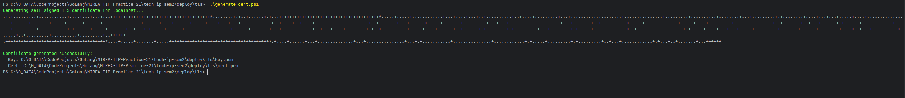

### 2. Запуск PostgreSQL и NGINX в Docker
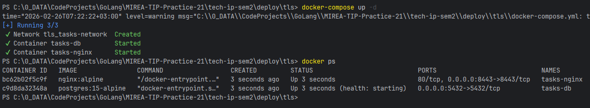

### 3. Запуск Auth service

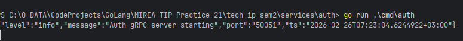

### 4. Запуск Tasks service

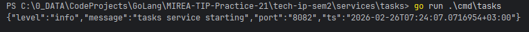

### 5. Создание тестовых задач через HTTPS

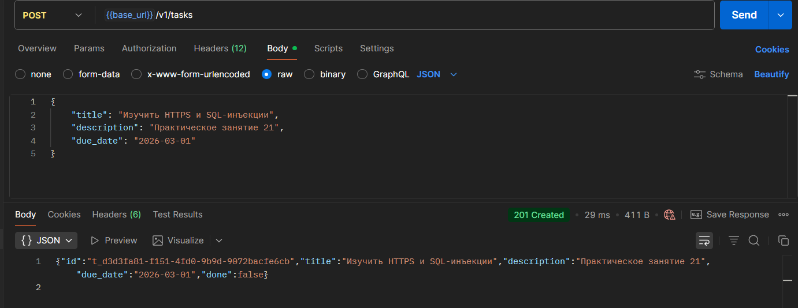

### 6. Успешный поиск (безопасный режим)

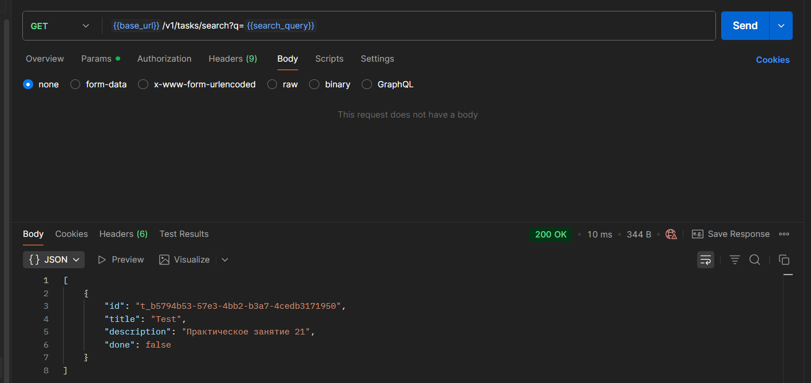

### 7. Демонстрация SQL-инъекции (unsafe mode)

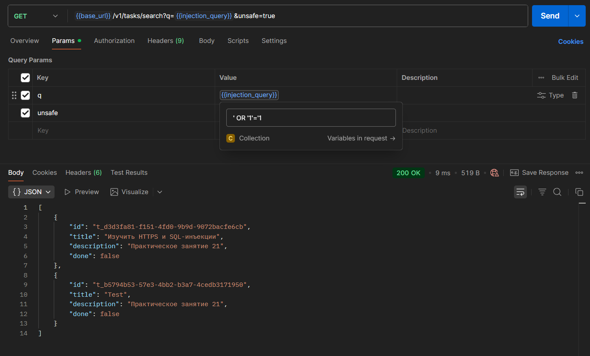

### 8. Тот же запрос в безопасном режиме

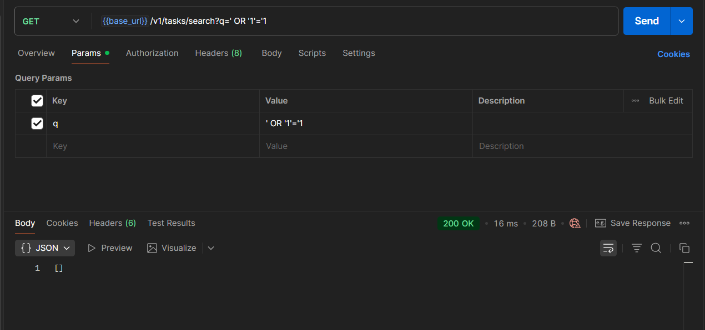

### 9. Выполнение тестового скрипта test_sqli.ps1


### 10. Проверка сертификата в браузере

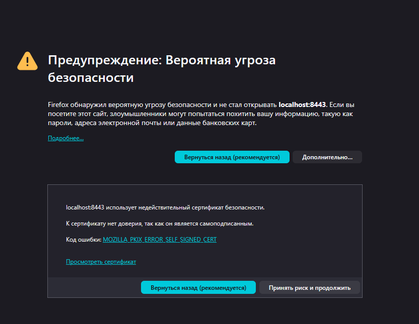

### 11. Postman коллекция (HTTPS запросы)


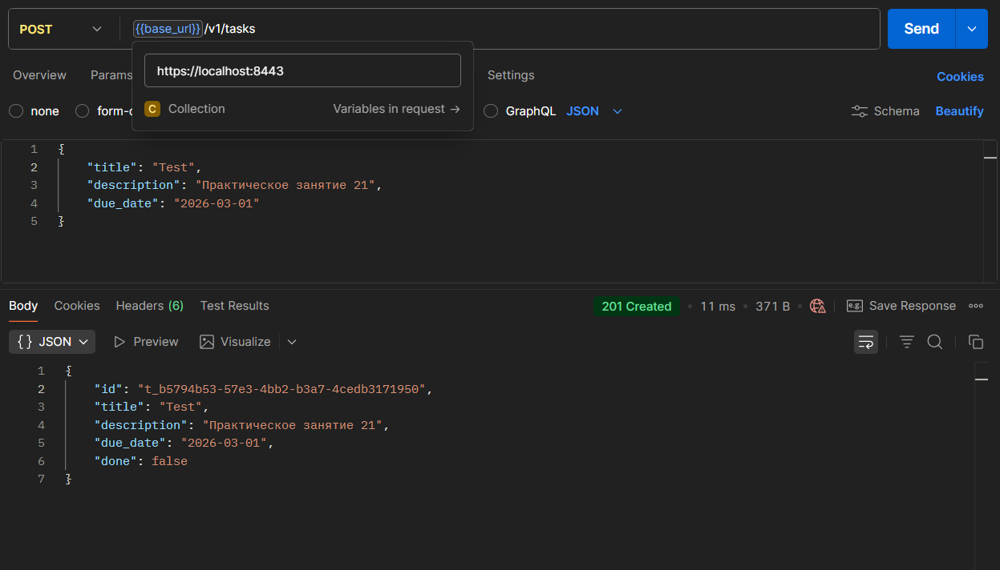

### 12. Логи Tasks service с SQL-запросами

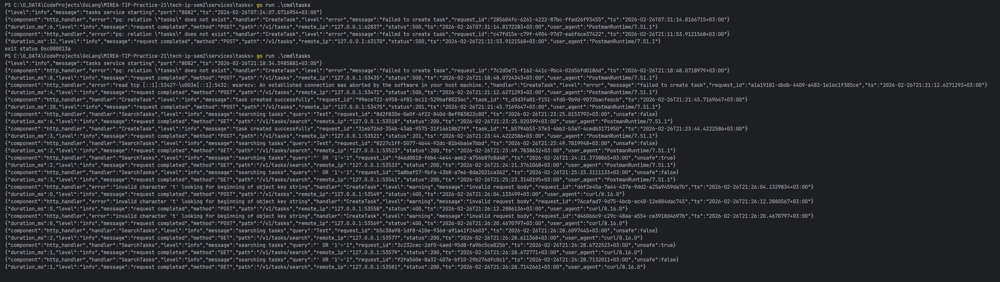

---

## Примеры работы

### Создание задачи через HTTPS

```bash
curl -k -X POST https://localhost:8443/v1/tasks \
  -H "Content-Type: application/json" \
  -H "Authorization: Bearer demo-token" \
  -d '{"title":"Безопасность","description":"HTTPS и SQL-инъекции","due_date":"2026-03-01"}'
```

**Ответ:**
```json
{
  "id": "t_550e8400-e29b-41d4-a716-446655440000",
  "title": "Безопасность",
  "description": "HTTPS и SQL-инъекции",
  "due_date": "2026-03-01",
  "done": false
}
```

### Уязвимый поиск (SQL-инъекция)

```bash
curl -k -G "https://localhost:8443/v1/tasks/search" \
  -H "Authorization: Bearer demo-token" \
  --data-urlencode "q=' OR '1'='1" \
  --data-urlencode "unsafe=true"
```

**Результат:** Возвращаются **все** задачи из базы данных, так как запрос преобразуется в:
```sql
SELECT ... FROM tasks WHERE title LIKE '%' OR '1'='1%'
```

### Безопасный поиск

```bash
curl -k -G "https://localhost:8443/v1/tasks/search" \
  -H "Authorization: Bearer demo-token" \
  --data-urlencode "q=' OR '1'='1"
```

**Результат:** Пустой массив, так как ищется буквальная строка "' OR '1'='1".

---

## Выводы

В ходе выполнения практического занятия №21 были достигнуты следующие результаты:

### HTTPS/TLS
1. **Выбран и реализован подход с NGINX как TLS-терминатором**, что соответствует промышленной практике.
2. **Сгенерирован самоподписанный сертификат** для локального тестирования с помощью OpenSSL.
3. **Настроен NGINX** для приёма HTTPS-трафика на порту 8443 и проксирования его в tasks сервис по HTTP.
4. **Настроен Docker Compose** для совместного запуска PostgreSQL и NGINX.
5. **Проверена работа HTTPS** через curl с флагом `-k` и через Postman с отключённой проверкой сертификата.

### Защита от SQL-инъекций
1. **Реализован слой репозитория** с интерфейсом `TaskRepository` и реализацией для PostgreSQL.
2. **Создана уязвимая версия поиска** `SearchByTitleUnsafe` для демонстрации SQL-инъекции.
3. **Реализована безопасная версия** `SearchByTitle` с использованием параметризованных запросов (плейсхолдер `$1`).
4. **Добавлен эндпоинт `/v1/tasks/search`** с параметром `unsafe` для переключения между версиями.
5. **Написан тестовый скрипт** `test_sqli.ps1`, наглядно демонстрирующий разницу между уязвимым и безопасным подходами.
6. **Проведена демонстрация**: уязвимая версия позволяет через инъекцию `' OR '1'='1` получить все записи, в то время как безопасная версия корректно обрабатывает ввод как литерал.

### Общие результаты
- Система полностью функционирует по HTTPS, обеспечивая шифрование трафика.
- База данных защищена от SQL-инъекций во всех эндпоинтах, кроме специально отмеченного демонстрационного.
- Сохранена сквозная трассировка через `X-Request-ID`.
- Интегрированы все предыдущие наработки (логирование, метрики, gRPC).

Таким образом, сервис приобрёл базовые механизмы безопасности, необходимые для эксплуатации в реальных условиях.

---

## Контрольные вопросы

### 1. Какие свойства даёт TLS соединению?

TLS (Transport Layer Security) обеспечивает три ключевых свойства:
- **Конфиденциальность** — данные шифруются и не могут быть прочитаны при перехвате.
- **Целостность** — данные не могут быть изменены без обнаружения (защита от подмены).
- **Аутентификация** — клиент может убедиться, что общается с подлинным сервером (через проверку сертификата).

### 2. Почему самоподписанный сертификат не подходит для реального продакшна?

Самоподписанный сертификат не подходит для продакшна, потому что:
- Браузеры и клиенты не доверяют ему по умолчанию (выдают предупреждение).
- Отсутствует цепочка доверия до корневого центра сертификации (CA).
- Пользователь не может быть уверен, что сертификат действительно принадлежит данному сервису, а не злоумышленнику.
- Многие автоматизированные клиенты отвергают самоподписанные сертификаты.

Для продакшна необходимо использовать сертификаты от доверенных CA (например, Let's Encrypt).

### 3. В чём отличие TLS-терминации на NGINX от TLS в приложении?

**TLS-терминация на NGINX:**
- TLS заканчивается на NGINX, далее трафик идёт по HTTP внутри сети.
- Централизованное управление сертификатами.
- NGINX может выполнять дополнительные функции (балансировка, сжатие, кэширование).
- Приложение не знает о TLS и работает как обычно.

**TLS в приложении:**
- Приложение само обрабатывает TLS-соединения.
- Каждый сервис требует собственных сертификатов и настроек.
- Больше контроля, но сложнее в управлении.
- Трафик шифруется на всём пути, включая внутренние сети.

### 4. Как возникает SQL-инъекция?

SQL-инъекция возникает, когда пользовательский ввод напрямую встраивается в SQL-запрос без надлежащей обработки. Например:

```go
// Уязвимый код
query := "SELECT * FROM users WHERE name = '" + userName + "'"
```

Если злоумышленник передаст `' OR '1'='1`, запрос превратится в:
```sql
SELECT * FROM users WHERE name = '' OR '1'='1'
```
что вернёт всех пользователей.

### 5. Почему параметризованный запрос защищает от SQLi?

Параметризованный запрос (использование плейсхолдеров) защищает, потому что:
- Данные передаются отдельно от структуры SQL-запроса.
- База данных чётко различает код SQL и данные.
- Специальные символы в данных (кавычки, точки с запятой) автоматически экранируются и не могут изменить логику запроса.
- Даже если злоумышленник передаст `' OR '1'='1`, это будет интерпретироваться как строковый литерал, а не как часть SQL.

### 6. Почему детали ошибок БД нельзя показывать клиенту?

Детали ошибок БД нельзя показывать клиенту, потому что:
- Они могут раскрыть структуру базы данных (имена таблиц, колонок).
- Могут содержать фрагменты данных (части записей).
- Помогают злоумышленнику понять уязвимости системы.
- Могут содержать техническую информацию о версии СУБД.

Правильный подход:
- В логах сервера сохранять полную информацию об ошибке.
- Клиенту возвращать общее сообщение: `{"error":"internal server error"}`.

---

## Приложение: Postman коллекция

В репозитории доступна [Postman коллекция](https://www.postman.com/lively-flare-564043/workspace/learning/collection/42992055-c4f47c2a-7314-4cd1-b231-655f9d91f362?action=share&source=copy-link&creator=42992055) со следующими группами запросов:

- **Tasks Service (HTTPS)** — основные CRUD-операции через HTTPS
- **SQL Injection Demo** — запросы для демонстрации уязвимости
- **Test Scenarios** — вспомогательные запросы

**Важно:** При использовании Postman необходимо отключить проверку SSL-сертификатов (Settings → SSL certificate verification → OFF).
